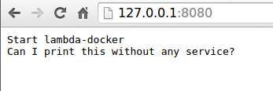
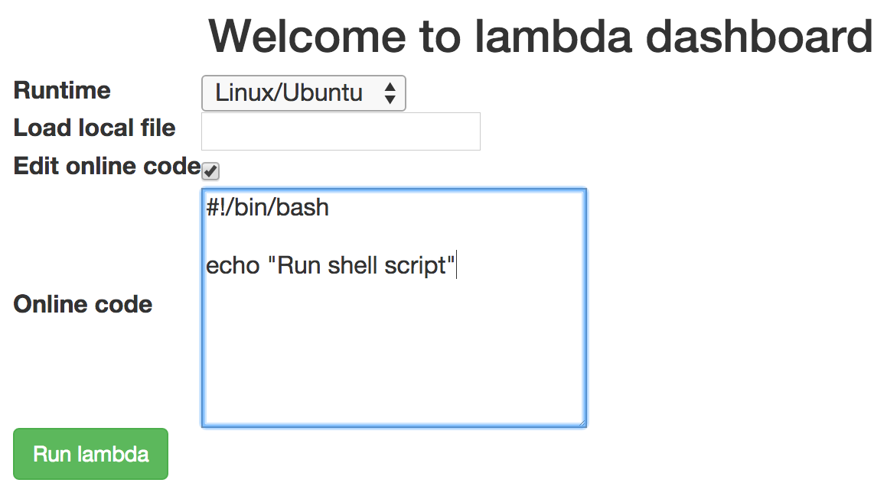
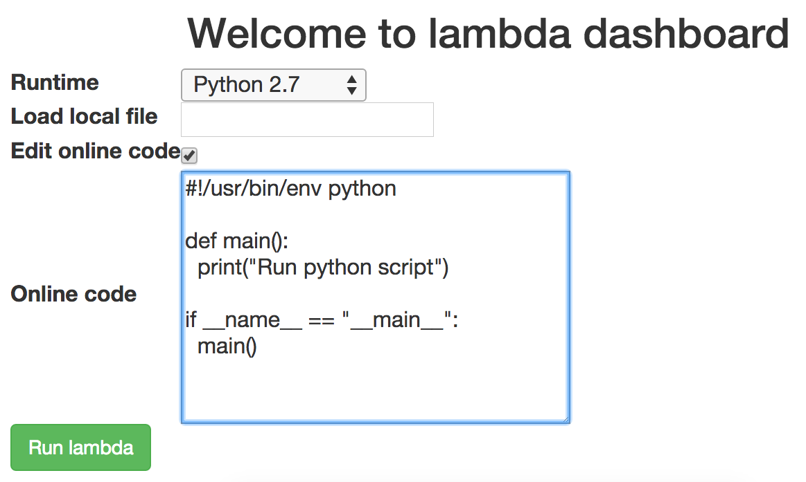
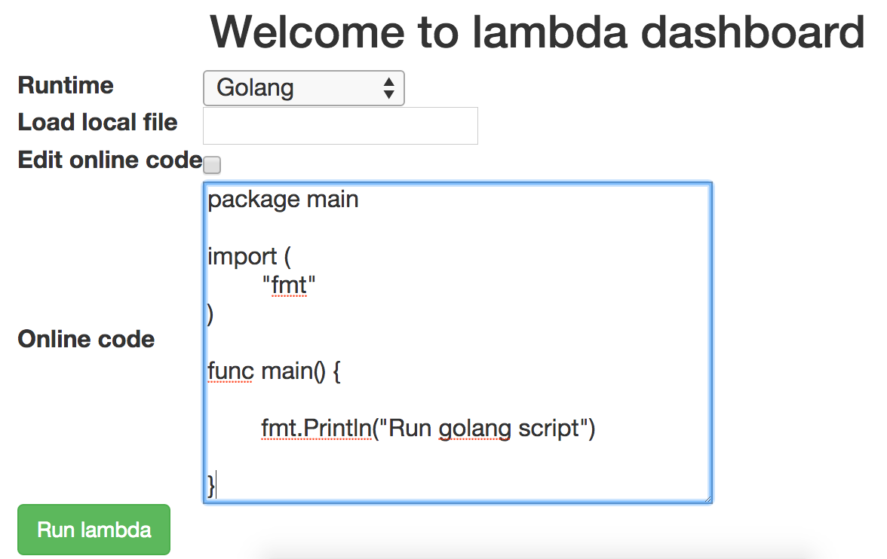
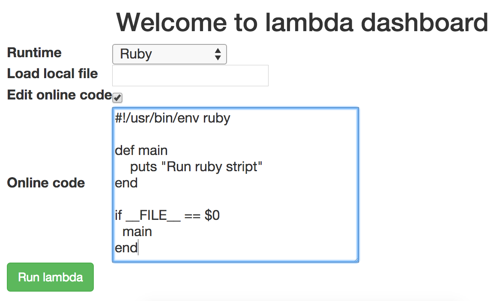
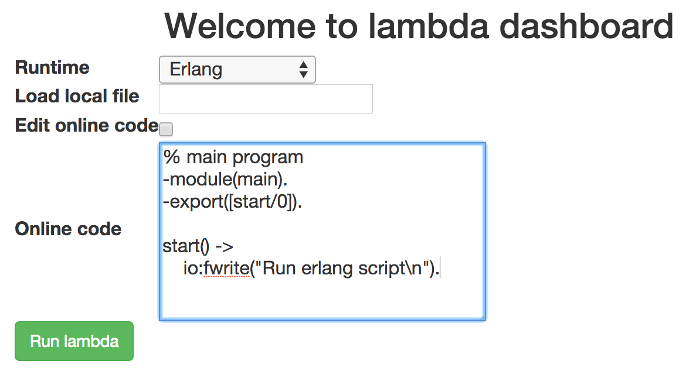

# Lambda docker

## Introduction

Lambda-docker is the event-driven code runtime like [AWS Lambda](https://aws.amazon.com/lambda/) service.

You can run Python/Golang/Ruby/Java/Javascript/Erlang/Shell or any script without setting up servers.

- [x] Python
  - [x] Python 2.7
  - [x] Python 3.5
  - [x] TensorFlow 0.8
- [x] Golang
- [x] Java
  - [x] Java 6
  - [x] Java 7
  - [x] Java 8
  - [x] Java 9
  - [x] OpenJDK 6
  - [x] OpenJDK 7
  - [x] OpenJDK 8
  - [x] OpenJDK 9
- [x] JavaScript
  - [x] NodeJS
- [x] C
- [x] CPP
- [x] Ruby
- [x] Erlang
- [x] Shell
  - [x] Ubuntu
  - [x] CentOS
- [x] PHP
- [x] Perl  
- [ ] C#
- [ ] VB
- [ ] Pascal
- [x] Rust
- [x] Elixir
- [x] R
- [x] Lua
- [ ] Lisp
- [x] Objective-c
- [x] Swift
- [ ] Clojure
- [x] Haskell

## Usage

```
sudo ./server.py
```

Or run in container.

```
docker run -d -v /var/run/docker.sock:/var/run/docker.sock -v /tmp:/tmp -p 8080:8080 tobegit3hub/lambda-docker
```

## Demonstration

Run lambda-docker server and go to <http://127.0.0.1:8080>.


The user script runs in container without any configuration.



Shell runtime is support now!



Python runtime is support now!



Golang runtime is support now!



Ruby runtime is support now!



Erlang runtime is support now!




