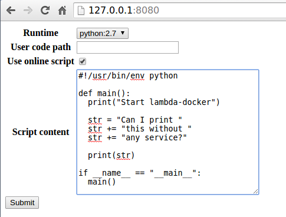

# Lambda docker

## Introduction

Lambda-docker is the event-driven code runtime like [AWS Lambda](https://aws.amazon.com/lambda/) service.

You can run Python/Golang/Ruby/Java/Javascript/Erlang/Shell or any script without setting up servers.

- [x] Python
  - [x] Python:2.7
  - [x] Python:3.5
- [x] Golang
- [x] Java
- [x] JavaScript
  - [x] NodeJS
- [x] Ruby
- [x] Erlang
- [x] Shell
  - [x] Ubuntu
  - [x] CentOS
- [ ] Rust
- [ ] Elixir
- [ ] R

## Usage

```
sudo ./server.py
```

Or run lambda-docker in container.

```
docker run -d -v /var/run/docker.sock:/var/run/docker.sock -v /tmp:/tmp -p 8080:8080 tobegit3hub/lambda-docker
```

## Demonstration

Run lambda-docker server and go to <http://127.0.0.1:8080>.



The user script runs in container without any configuration.


